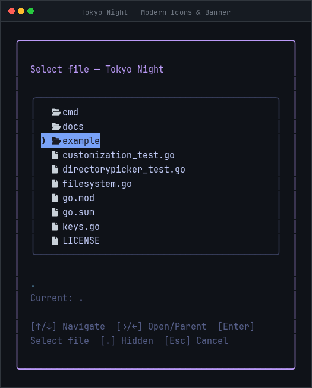
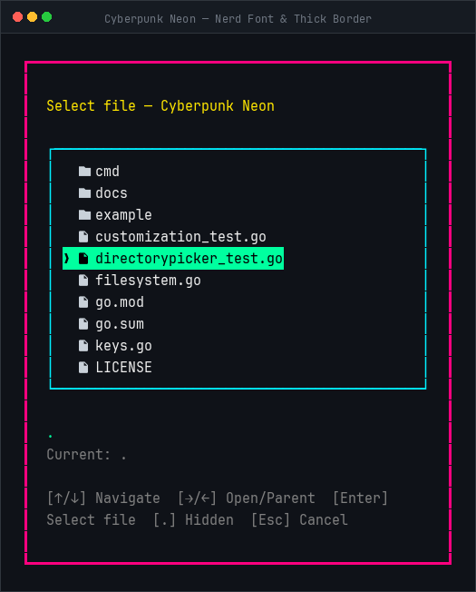
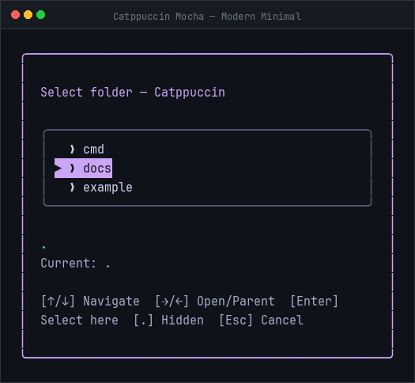
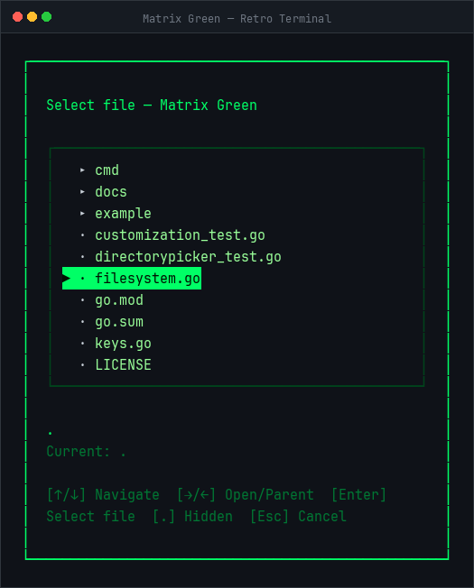

# directorypicker

A customizable, keyboard-driven file and directory picker component for Go TUI applications built with [Bubble Tea](https://github.com/charmbracelet/bubbletea) and [Lip Gloss](https://github.com/charmbracelet/lipgloss).

Supports modal dialog or embedded layouts, vim navigation, custom icon sets, sorting, file extension filtering, and built-in themes.

---

## Features

- **Keyboard-driven navigation**: Standard arrow keys + Vim shortcuts (`h`/`j`/`k`/`l`), `Home`/`End`, `PgUp`/`PgDown`.
- **Typed selection modes**: `SelectFile` or `SelectDirectory`.
- **Layout styles**: `Centered` floating modal or `Embedded` inside your existing layout.
- **Deep visual customization**: Custom borders (Rounded, Double, Thick, Normal, Hidden), colors, and custom icon sets (`DirIcon`, `FileIcon`, `Cursor`).
- **File extension filtering**: Filter listings by extensions (e.g. `[]string{".go", ".md"}`).
- **Configurable sorting**: Directories first, Name A→Z / Z→A, Files first, Size descending.
- **Hidden files**: Toggle visibility at runtime with `.` or configure default on/off.
- **Non-blocking I/O**: Directory reads run asynchronously via Bubble Tea commands (`tea.Cmd`).


---

## Interactive Setup

The fastest way to configure and scaffold `directorypicker` into your Go project is via the interactive CLI setup:

```bash
go run github.com/agmonetti/directorypicker/cmd/setup@latest
```

The wizard guides you step-by-step through:
1. **Selection mode**: Files or Directories
2. **Layout**: Centered modal popup or embedded inline
3. **Visual design**: Color palette (Tokyo Night, Catppuccin, Dracula, Cyberpunk, Nord, Matrix, Azure), border style, icon sets (Emojis, Nerd Font, Modern, Classic), and active row highlight (Banner, Text, Underline)
4. **Filtering & Sorting**: File extension filtering and configurable sort order
5. **Keybindings**: Vim-style shortcuts (`h`/`j`/`k`/`l`)
6. **Live Preview**: Interactive terminal test before saving
7. **Code Generation**: Generates a ready-to-run `main.go` or a drop-in helper function

---

## Installation

```bash
go get github.com/agmonetti/directorypicker
```

---

## Basic Usage

```go
package main

import (
	"fmt"
	"os"

	"github.com/agmonetti/directorypicker"
	tea "github.com/charmbracelet/bubbletea"
)

type appModel struct {
	picker   directorypicker.Model
	selected string
}

func (m appModel) Init() tea.Cmd {
	return m.picker.Init()
}

func (m appModel) Update(msg tea.Msg) (tea.Model, tea.Cmd) {
	switch msg := msg.(type) {
	case directorypicker.SelectedMsg:
		m.selected = msg.Path
		return m, tea.Quit
	case directorypicker.CancelledMsg:
		m.selected = "(cancelled)"
		return m, tea.Quit
	}

	var cmd tea.Cmd
	m.picker, cmd = m.picker.Update(msg)
	return m, cmd
}

func (m appModel) View() string {
	return m.picker.View()
}

func main() {
	picker := directorypicker.New(directorypicker.Options{
		Title:       "Select a file",
		InitialPath: ".",
		Mode:        directorypicker.SelectFile,
		Layout:      directorypicker.Centered,
		Styles:      directorypicker.TokyoNightStyles(),
	})

	p := tea.NewProgram(appModel{picker: picker}, tea.WithAltScreen())
	if _, err := p.Run(); err != nil {
		fmt.Printf("Error: %v\n", err)
		os.Exit(1)
	}
}
```

---

## Custom Themes via YAML

You can define and distribute custom themes as external `.yaml` files:

```yaml
name: "Nord Frost"
colors:
  accent: "#88c0d0"
  text: "#eceff4"
  muted: "#4c566a"
  dim: "#3b4252"
  border: "#434c5e"
  border_focus: "#88c0d0"
  error: "#bf616a"
borders:
  popup: "rounded"       # rounded, double, thick, normal, hidden, none
  dir_list: "rounded"
icons:
  cursor: "❯ "
  dir_icon: "📁 "
  file_icon: "📄 "
selection:
  foreground: "#2e3440"
  background: "#88c0d0"
  bold: true
  underline: false
```

### Loading at Runtime

```go
styles, err := directorypicker.LoadThemeFile("path/to/theme.yaml")
if err != nil {
    log.Fatalf("Invalid theme: %v", err)
}

picker := directorypicker.New(directorypicker.Options{
    Styles: styles,
    // ...
})
```

Theme files are strictly validated upon load: missing required fields, invalid hex codes, or unrecognized borders return descriptive error messages.

Reference themes are provided in [`examples/themes/`](examples/themes/):
- [`examples/themes/dracula.yaml`](examples/themes/dracula.yaml)
- [`examples/themes/catppuccin.yaml`](examples/themes/catppuccin.yaml)
- [`examples/themes/nord.yaml`](examples/themes/nord.yaml)

You can also pass a custom theme directly to the interactive setup wizard:

```bash
go run github.com/agmonetti/directorypicker/cmd/setup --theme examples/themes/nord.yaml
```

---


## Examples

| **Tokyo Night** (Modern Icons & Banner) | **Cyberpunk Neon** (Nerd Font & Thick Border) |
|:---:|:---:|
|  |  |
| **Catppuccin Mocha** (Folder Mode & Minimal) | **Matrix Green** (Retro Phosphor Terminal) |
|  |  |

---

## Guides & Documentation

- [Customization Guide](docs/CUSTOMIZATION.md): Detailed styling, custom keymaps, and options.
- [Integration Guide](docs/INTEGRATION.md): Bubble Tea lifecycle, messages, resizing, and embedding.
- [Installation Guide](docs/INSTALLATION.md): Requirements and release checklists.

---

## License

[MIT](LICENSE) © [Agustin Monetti](https://github.com/agmonetti)
